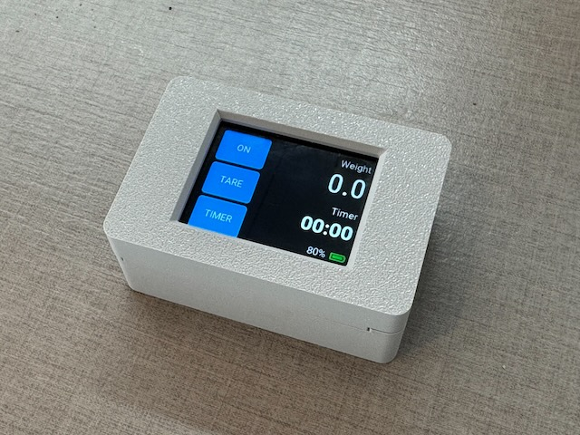

# Remote Control for Decent Scale

This code is configured to run on Waveshare Touch LCD 2 which is a development board that includes a touch display and is based on the Esp32-s3 processor.
I used Espressif'ss ESP-IDF development environment.
You can unpack the release zip and then flash the firmware to the development board using the flash.sh.
Make sure you connect the Waveshare board via USB-C and that you installed the USB driver for the USB chip used on the board.
Please refer to the Waveshare documentation.

# How it works
After switching the device on pressing a physical button on the right hand side of the case next to the USB-C connector it will boot up and show zero values.
Touching the "ON" button will start the BLE process that tries to find the scale. If a scale is available it will connect to it.
Make sure the scale is not connected to the espresso machine at that point.

The "ON" button now displays "OFF". 
- Touch the "OFF" button briefly to disconnect the scale but leave it turned on.
- Touch the "OFF" button longer and it will turn the device off AND put the scale in sleep mode.

# Notes for programming on my MAC
## initialize shell for esp-idf:

. /Users/hvo/Esp/v5.4.1/Esp-idf/export.sh

use UART to flash
select interface first: /dev/cu.usbmodem101 or /dev/tty.usbmodem101

## Acknowledgments

This project uses ESP-IDF by Espressif Systems.

## Hardware Compatibility

This project is designed to work with the Waveshare Touch LCD 2 display.

_Waveshare is a trademark of Shenzhen Weixue Electronic Co., Ltd. This project is not affiliated with or endorsed by Waveshare._
